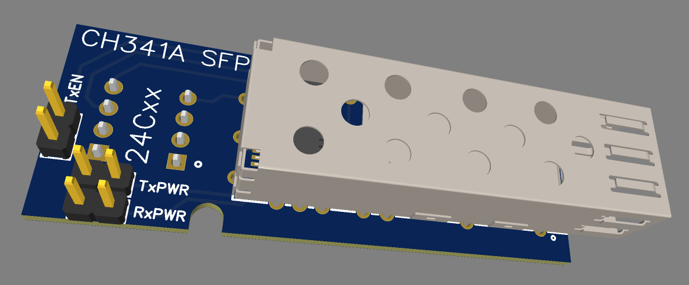

# SFP-Master
SFP-module data programmer for CH341a devices

 

**SFP-Master** is a free software programmer of optical `SFP modules` for CH341a devices. It can be 
used to read, write and save SFP module data to the computer. It requires an SFP to I2C adapter. 
This adapter is used to read and program SFP-module data. It must be inserted into the slot labelled 
`24xxx` of the CH341a programmer.

- See more details [here](https://github.com/bigbigmdm/Tools_for_CH341A_programmer?tab=readme-ov-file#Homemade-Chip-adapters).

Jumpers J1 to J3 must be installed initially. They are used to supply power to the SFP module. If you want 
to programm a module with hardware write protection, remove one of the jumpers and try to programm the module. 
If it fails, remove the other jumper and repeat the operation.

# Installing in Linux

For build are needed:
- g++ or clang
- CMake
- libusb 1.0
- Qt5
- Qt5 Qt5LinguistTools
- pkgconf or pkg-config
- udev

On Debian and derivatives:

`sudo apt-get install cmake g++ libusb-1.0-0-dev qtbase5-dev qttools5-dev pkgconf`

On Debian >=13 and Ubuntu >=23.10:

`sudo apt-get install systemd-dev`

On older:

`sudo apt-get install udev`

To build and install the SFP-Master enter:

`sudo ./build_all.sh`

To uninstall, enter:

`sudo ./uninstall.sh`

## Connection

To work with the programmer, connect the SFP module to the connector in the SFP adapter, connect 
the SFP adapter to the CH341A programmer device to the slot marked `24xx`. Connect the CH341A 
Programmer Unit to the USB connector of the computer and start the `SFP-Master` programm.

## How to use
- Pressing `SFP-module / Read from SFP` or  or `<Ctrl+R>` to read data from 
the SFP-module into the computer buffer.
- Pressing `SFP-module / Write to SFP` or  or `<Ctrl+W>` to write data from the 
computer buffer into the SFP-module.
- The `File / Save` or  or `<Ctrl+S>` button is used to save the 
computer buffer to a file.
- The `File / Open`  or  or `<Ctrl+O>` button is used to save the file in 
the computer buffer.
- 
